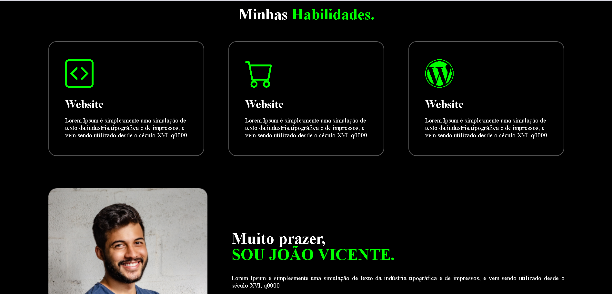

# Portfolio-para-devs
Criando meu portfólio pessoal, quem quiser pode utilizar como template

Para acessar basta entrar pelo link: https://jvdevs.github.io/Portfolio-para-devs-template/

Caso queira o código para baixar e editar á uso próprio, pode realizar um 'fork', no canto direito da página.

Se preferir pode baixar o .zip do projeto na aba code(ícone verde)

Ou por final se quiser copiar o código para uma pasta própria.

1) Baixar o git com o gitbash. https://git-scm.com/downloads
2) Criar uma pasta para seu projeto no seu computador
3) Pegar a url do repositório na aba 'code', após 'local', 'https', e copiar o link abaixo
4) Abrir sua pasta e clicar dentro dela com o botão direito do mouse
5) Abrir com o git bash
6) Executar o comando: git clone + url. url nesse caso é https://github.com/jvdevs/Portfolio-para-devs-template.git
7) Pronto, depois disso os códigos desse repositório estarão na sua máquina
